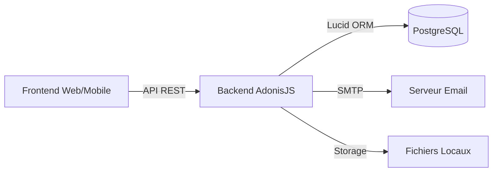
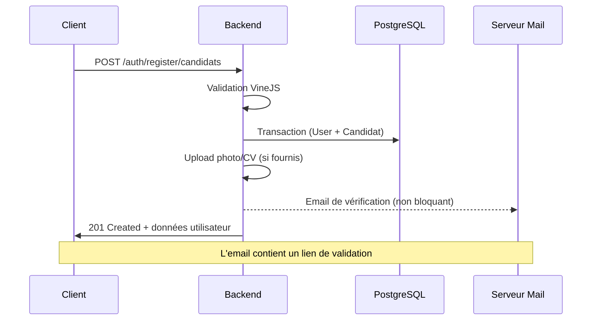
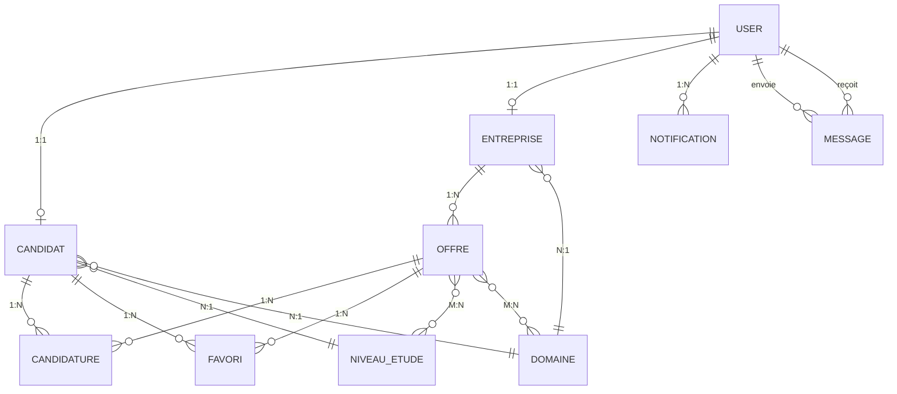

# Product Requirements Document (PRD)

## Backend Pôle Emploi — PAJDEF

|             |                                           |
| ----------- | ----------------------------------------- |
| **Projet**  | Backend API REST — Plateforme Pôle Emploi |
| **Version** | 1.0.0                                     |
| **Date**    | 21 février 2026                           |
| **Statut**  | En développement                          |
| **Stack**   | AdonisJS v6, PostgreSQL, Node.js (ESM)    |

---

## 1. Contexte et Objectifs

### 1.1 Finalité du produit

Le backend Pôle Emploi est une **API REST** servant de socle à une plateforme de mise en relation entre **candidats** et **recruteurs** en Côte d'Ivoire (région de Ferkéssédougou). Le système est développé dans le cadre du projet PAJDEF et vise à :

- Faciliter la recherche d'emploi pour les candidats
- Permettre aux recruteurs de publier des offres et gérer les candidatures
- Offrir un système de messagerie et de notifications en temps réel
- Assurer la sécurité et la traçabilité des données

### 1.2 Rôle dans l'écosystème



Le backend expose une **API RESTful JSON** consommée par le frontend (web ou mobile). Il est le **point central** de toute la logique métier : authentification, gestion des profils, offres d'emploi, candidatures, messagerie et notifications.

### 1.3 Base pour le frontend

Le frontend s'appuiera sur cette API pour :

| Besoin frontend               | Endpoint(s) backend                                                       |
| ----------------------------- | ------------------------------------------------------------------------- |
| Pages d'inscription/connexion | `POST /auth/register/*`, `POST /auth/login`                               |
| Dashboard candidat            | `GET /auth/me`, `GET /candidatures`, `GET /favoris`, `GET /notifications` |
| Dashboard recruteur           | `GET /auth/me`, `GET /offres`, `GET /candidatures`, `GET /notifications`  |
| Recherche d'offres            | `GET /offres` (filtres, pagination)                                       |
| Messagerie                    | `GET /messages`, `POST /messages`                                         |
| Gestion de profil             | `PUT /candidats/:id`, `PUT /entreprises/:id`                              |

---

## 2. Fonctionnalités Principales

### 2.1 Authentification et Gestion des Utilisateurs

#### Rôles et permissions

| Rôle          | Permissions                                                                  |
| ------------- | ---------------------------------------------------------------------------- |
| **CANDIDAT**  | Postuler, gérer favoris, envoyer/recevoir messages, consulter offres         |
| **RECRUTEUR** | Créer/gérer offres, accepter/refuser candidatures, envoyer/recevoir messages |
| **ADMIN**     | Créer notifications broadcast, accès complet                                 |

#### Endpoints d'authentification

| Méthode | Endpoint                        | Description                                 | Auth |
| ------- | ------------------------------- | ------------------------------------------- | ---- |
| `POST`  | `/api/auth/register/candidats`  | Inscription candidat (avec photo/CV)        | ❌   |
| `POST`  | `/api/auth/register/recruteurs` | Inscription recruteur (avec logo)           | ❌   |
| `POST`  | `/api/auth/login`               | Connexion (retourne access + refresh token) | ❌   |
| `POST`  | `/api/auth/logout`              | Déconnexion (révoque tous les tokens)       | ✅   |
| `POST`  | `/api/auth/refresh-token`       | Rafraîchir le token d'accès                 | ❌   |
| `GET`   | `/api/auth/verify-email`        | Validation du compte par email              | ❌   |
| `POST`  | `/api/auth/forgot-password`     | Demande de réinitialisation mot de passe    | ❌   |
| `POST`  | `/api/auth/reset-password`      | Réinitialisation du mot de passe            | ❌   |
| `GET`   | `/api/auth/me`                  | Profil de l'utilisateur connecté            | ✅   |
| `PUT`   | `/api/auth/change-password`     | Changer le mot de passe                     | ✅   |

#### Système de tokens

- **Access Token** : validité 12h, préfixe `oat_`, type `auth_token`
- **Refresh Token** : validité 30 jours, préfixe `rat_`, type `refresh_token`
- **Rotation** : chaque refresh génère un nouveau couple access + refresh et révoque l'ancien
- **Stockage** : table `auth_access_tokens` (PostgreSQL)

#### Flux d'inscription



#### Règles de validation (Payloads)

- **Inscription Candidat (multipart/form-data)** : `nom` (2-80), `prenom` (3-80), `email`, `password` (min 8, confirmed), `role` (CANDIDAT), `telephone` (10-15), `experience` (min 0), `niveauEtudeId`, `domaineId`, `sexe` (masculin/feminin), `etatCivil`, `ville`, `dateNaissance` (<= today). Optionnels : `photo` (2MB max, jpg/png), `CurriculumVitae` (5MB max, pdf/doc).
- **Inscription Recruteur (multipart/form-data)** : `nom`, `prenom`, `email`, `password`, `role` (RECRUTEUR), `nomEntreprise`, `description`, `telephone`, `domaineId`, `adresse`, `ville`, `pays`, `civilite`. Optionnels : `codePostal`, `siteWeb`, `logo`.
- **Login JSON** : `email`, `password`. Réponse : `{ type: "bearer", token: "oat_...", refreshToken: "rat_...", user: {...} }`

---

### 2.2 Gestion des Offres d'Emploi

| Méthode  | Endpoint          | Description                                     | Auth | Rôle      |
| -------- | ----------------- | ----------------------------------------------- | ---- | --------- |
| `GET`    | `/api/offres`     | Liste des offres actives (filtres + pagination) | ❌\* | Tous      |
| `GET`    | `/api/offres/:id` | Détail d'une offre                              | ❌   | Tous      |
| `POST`   | `/api/offres`     | Créer une offre                                 | ✅   | RECRUTEUR |
| `PUT`    | `/api/offres/:id` | Modifier une offre (propriétaire)               | ✅   | RECRUTEUR |
| `DELETE` | `/api/offres/:id` | Supprimer une offre (propriétaire)              | ✅   | RECRUTEUR |

> **\*** Route publique avec **auth optionnelle** : si un token Bearer est fourni, les résultats sont personnalisés par rôle.

#### Filtres disponibles sur `GET /offres`

| Paramètre         | Type   | Description                                    |
| ----------------- | ------ | ---------------------------------------------- |
| `page` / `limit`  | number | Pagination                                     |
| `typeOffre`       | enum   | Emploi, Stage, Interim, Freelance, Consultance |
| `localisation`    | string | Recherche partielle (ILIKE)                    |
| `search`          | string | Recherche titre + description                  |
| `domaine_id`      | uuid   | Filtrer par domaine                            |
| `niveau_etude_id` | uuid   | Filtrer par niveau d'étude                     |
| `all`             | bool   | Si `true`, désactive le filtre par rôle        |

#### Personnalisation par rôle (auth optionnelle)

| Utilisateur  | Comportement par défaut       | Avec `?all=true`  |
| ------------ | ----------------------------- | ----------------- |
| Non connecté | Toutes les offres actives     | —                 |
| CANDIDAT     | Offres de son domaine         | Toutes les offres |
| RECRUTEUR    | Ses propres offres uniquement | Toutes les offres |
| ADMIN        | Toutes les offres             | —                 |

#### Règles métier & Validations

- Seules les offres `active` sont listées
- L'ownership est vérifié via `OffrePolicy` pour update/delete
- Relations many-to-many avec `NiveauEtude` et `Domaine` via tables pivot
- **Création d'Offre (Payload JSON)** : `titre` (2-150 chars), `description`, `experienceMin`, `salaireMin`, `typeOffre` (Emploi, Stage, Interim, Freelance, Consultance), `localisation`, `dateLimite`, `niveauxEtudeIds` (array > 0), `domaineIds` (array > 0). `salaireMax` optionnel.
- **Réponse Offre** : `{ id, titre, description, statut, experienceMin, typeOffre, localisation, entreprise: { id, nomEntreprise, logo }, domaines: [...], niveauxEtude: [...] }`

---

### 2.3 Gestion des Candidatures

| Méthode  | Endpoint                | Description                                                    | Auth | Rôle                |
| -------- | ----------------------- | -------------------------------------------------------------- | ---- | ------------------- |
| `GET`    | `/api/candidatures`     | Liste (candidat: les siennes, recruteur: celles de ses offres) | ✅   | CANDIDAT, RECRUTEUR |
| `GET`    | `/api/candidatures/:id` | Détail d'une candidature                                       | ✅   | Propriétaire        |
| `POST`   | `/api/candidatures`     | Postuler à une offre                                           | ✅   | CANDIDAT            |
| `PUT`    | `/api/candidatures/:id` | Accepter/refuser                                               | ✅   | RECRUTEUR           |
| `DELETE` | `/api/candidatures/:id` | Retirer une candidature                                        | ✅   | CANDIDAT            |

#### Règles métier & Validations

- **Anti-doublon** : un candidat ne peut postuler qu'une fois par offre
- **Offre active** : impossible de postuler sur une offre expirée/suspendue
- **Création (Payload JSON)** : `offreId` (uuid), `lettreMotivation` (string optionnel).
- **Modification Statut (Payload JSON)** : `statut` (enum: `en_attente`, `acceptee`, `refusee`).
- **Structure Réponse `GET`** : Tableau paginé `{ meta: {...}, data: [ { id, statut, offre: { titre, entreprise: {...} }, candidat: { user: {...} } } ] }`
- **Notifications automatiques** :
  - Candidat postule → notification + email au recruteur
  - Recruteur accepte/refuse → notification + email au candidat

---

### 2.4 Gestion des Favoris

| Méthode  | Endpoint           | Description                   | Auth | Rôle     |
| -------- | ------------------ | ----------------------------- | ---- | -------- |
| `GET`    | `/api/favoris`     | Liste des favoris du candidat | ✅   | CANDIDAT |
| `POST`   | `/api/favoris`     | Ajouter une offre aux favoris | ✅   | CANDIDAT |
| `DELETE` | `/api/favoris/:id` | Retirer un favori             | ✅   | CANDIDAT |

- Anti-doublon : une offre ne peut être ajoutée qu'une fois
- Preload complet de l'offre avec entreprise, domaines, niveaux d'étude
- **Ajout Favori (Payload JSON)** : `offreId` (uuid).
- **Structure Réponse** : `{ id, candidatId, offreId, createdAt, offre: { titre, entreprise: {...} } }`

---

### 2.5 Notifications

| Méthode  | Endpoint                      | Description                 | Auth |
| -------- | ----------------------------- | --------------------------- | ---- |
| `GET`    | `/api/notifications`          | Liste paginée (filtre `lu`) | ✅   |
| `GET`    | `/api/notifications/:id`      | Détail                      | ✅   |
| `POST`   | `/api/notifications`          | Créer (admin uniquement)    | ✅   |
| `PATCH`  | `/api/notifications/:id/read` | Marquer comme lue           | ✅   |
| `PATCH`  | `/api/notifications/read-all` | Tout marquer comme lu       | ✅   |
| `DELETE` | `/api/notifications/:id`      | Supprimer                   | ✅   |

- Toutes les requêtes sont scoped à l'utilisateur connecté
- Types : `nouvelle_candidature`, `candidature_statut`, et extensible
- **Création Notification (Admin - Payload JSON)** : `type`, `message`, `userId`.
- **Structure Réponse** : `{ id, type, message, read, userId, createdAt }`

---

### 2.6 Messagerie

| Méthode  | Endpoint                          | Description                       | Auth |
| -------- | --------------------------------- | --------------------------------- | ---- |
| `GET`    | `/api/messages`                   | Conversations (filtre `user_id`)  | ✅   |
| `GET`    | `/api/messages/:id`               | Détail d'un message               | ✅   |
| `POST`   | `/api/messages`                   | Envoyer un message                | ✅   |
| `PATCH`  | `/api/messages/:id/read`          | Marquer comme lu                  | ✅   |
| `PATCH`  | `/api/messages/conversation-read` | Marquer conversation comme lue    | ✅   |
| `DELETE` | `/api/messages/:id`               | Supprimer (expéditeur uniquement) | ✅   |

- Impossible de s'envoyer un message à soi-même
- Seul le destinataire peut marquer comme lu
- Seul l'expéditeur peut supprimer
- **Envoi Message (Payload JSON)** : `receiverId` (uuid), `contenu` (string).
- **Structure Réponse** : `{ id, contenu, read, senderId, receiverId, createdAt }`

---

### 2.7 Profils Candidats et Entreprises

| Méthode | Endpoint               | Description                                     | Auth |
| ------- | ---------------------- | ----------------------------------------------- | ---- |
| `GET`   | `/api/candidats`       | Liste avec filtres (domaine, niveau, recherche) | ✅   |
| `GET`   | `/api/candidats/:id`   | Détail d'un candidat                            | ✅   |
| `PUT`   | `/api/candidats/:id`   | Modifier profil (propriétaire/admin)            | ✅   |
| `GET`   | `/api/entreprises`     | Liste des entreprises                           | ❌   |
| `GET`   | `/api/entreprises/:id` | Détail d'une entreprise                         | ❌   |
| `PUT`   | `/api/entreprises/:id` | Modifier profil entreprise                      | ✅   |

#### Validations & Réponses

- **Update Profil Candidat (multipart/form-data optionnel)** : `nom`, `prenom`, `email`, `telephone`, `experience`, `niveauEtudeId`, `domaineId`, `ville`, `photo`, `CurriculumVitae`.
- **Update Profil Entreprise (multipart/form-data optionnel)** : `nomEntreprise`, `description`, `domaineId`, `adresse`, `ville`, `pays`, `siteWeb`, `logo`.
- **Réponse Profil** : Retourne les objets fusionnés `{ user: {...}, candidat/entreprise: {...} }` avec les chemins HTTP absolus pour les fichiers uploadés (`photoPath`, `logoPath`).

---

### 2.8 Données de Référence

| Méthode | Endpoint             | Description                           | Auth |
| ------- | -------------------- | ------------------------------------- | ---- |
| `GET`   | `/api/domaines`      | Liste de tous les domaines d'activité | ❌   |
| `GET`   | `/api/niveau-etudes` | Liste de tous les niveaux d'étude     | ❌   |

Ces endpoints publics permettent au frontend d'alimenter ses formulaires (ex: filtres de recherche, formulaires d'inscription et de mise à jour de profil).

---

## 3. Architecture Technique

### 3.1 Stack technologique

| Composant        | Technologie                     | Version |
| ---------------- | ------------------------------- | ------- |
| Framework        | AdonisJS                        | v6.18   |
| Runtime          | Node.js (ESM)                   | ≥ 18.x  |
| ORM              | Lucid (AdonisJS)                | v21.6   |
| Base de données  | PostgreSQL                      | —       |
| Validation       | VineJS                          | v3.0    |
| Authentification | @adonisjs/auth (Access Tokens)  | v9.4    |
| Autorisation     | @adonisjs/bouncer (Policies)    | latest  |
| Email            | @adonisjs/mail + Edge templates | v9.2    |
| Langage          | TypeScript                      | ~5.8    |

### 3.2 Modèle de données



### 3.3 Tables et migrations (14)

| Ordre | Table                   | PK     | Remarques                                               |
| ----- | ----------------------- | ------ | ------------------------------------------------------- |
| 1     | `users`                 | UUID   | Rôle, statut, tokens de sécurité                        |
| 2     | `auth_access_tokens`    | auto   | Access + refresh tokens                                 |
| 3     | `domaines`              | UUID   | ~130 domaines d'activité                                |
| 4     | `secteur_activites`     | UUID   | Secteurs d'activité                                     |
| 5     | `entreprises`           | UUID   | FK → users, domaines                                    |
| 6     | `niveau_etudes`         | UUID   | Niveaux d'étude                                         |
| 7     | `candidats`             | UUID   | FK → users, niveau_etudes, domaines                     |
| 8     | `offres`                | UUID   | FK → entreprises, typeOffre enum                        |
| 9     | `candidatures`          | UUID   | FK → offres, candidats. Unique: (offre_id, candidat_id) |
| 10    | `favoris`               | UUID\* | FK → candidats, offres. Unique: (candidat_id, offre_id) |
| 11    | `messages`              | UUID   | FK → users (sender, receiver)                           |
| 12    | `notifications`         | UUID   | FK → users, type string extensible                      |
| 13    | `offres_niveaux_etudes` | —      | Table pivot M:N                                         |
| 14    | `offres_domaines`       | —      | Table pivot M:N                                         |

> **\*** La table `favoris` nécessite une migration corrective (`increments` → `uuid`).

### 3.4 Structure du projet

```
backend-pole-emploi/
├── app/
│   ├── controllers/        # 8 controllers (auth, candidats, entreprises, offres, candidatures, favoris, notifications, messages)
│   ├── models/             # 11 modèles Lucid
│   ├── policies/           # 6 policies Bouncer (Offre, Candidature, Favori, Candidat, Notification, Message)
│   ├── abilities/          # Abilities Bouncer (fichier requis par le middleware)
│   ├── validators/         # 8 validators + _messages.ts centralisé
│   ├── middleware/          # Middleware auth + initialize_bouncer
│   └── exceptions/         # Gestionnaire d'exceptions global
├── config/                 # app, auth, database, mail, cors, hash
├── database/
│   ├── migrations/         # 14 migrations
│   └── seeders/            # 4 seeders (admin, domaines, niveaux, secteurs)
├── resources/views/emails/ # 4 templates Edge (verify, reset, candidature, statut)
├── start/
│   ├── routes.ts           # Toutes les routes
│   ├── kernel.ts           # Middleware pipeline
│   └── env.ts              # Validation des variables d'environnement
└── storage/uploads/        # Fichiers uploadés
    ├── candidats/photos/
    ├── candidats/curriculum_vitae/
    └── entreprises/logos/
```

### 3.5 Modularité et scalabilité

- **Séparation des responsabilités** : Controller → Validator → Policy → Model
- **Autorisation par policies** : `@adonisjs/bouncer` avec 6 policies regroupées par modèle (OffrePolicy, CandidaturePolicy, FavoriPolicy, CandidatPolicy, NotificationPolicy, MessagePolicy)
- **Hooks Lucid** : UUID auto-générés via `@beforeCreate()`
- **Relations déclaratives** : belongsTo, hasMany, manyToMany avec preload lazy
- **Validation centralisée** : `_messages.ts` pour les messages FR, importé par tous les validators
- **Variables d'environnement** : validées au démarrage via `env.ts`
- **Hot Module Replacement** : rechargement automatique en dev (controllers + middleware)

---

## 4. Workflows et Intégrations

### 4.1 Seeders

| Seeder                    | Données                                    | Idempotent             |
| ------------------------- | ------------------------------------------ | ---------------------- |
| `admin_seeder`            | 1 utilisateur admin (`admin@pajdef.com`)   | ✅ Vérifie l'existence |
| `domaine_seeder`          | ~130 domaines d'activité                   | ✅ Vérifie par libellé |
| `niveau_etude_seeder`     | Niveaux d'étude (BEPC, BAC, Licence, etc.) | ✅                     |
| `secteur_activite_seeder` | Secteurs d'activité                        | ✅                     |

Exécution : `node ace db:seed`

### 4.2 Intégration email (SMTP)

| Événement                 | Template                    | Destinataire |
| ------------------------- | --------------------------- | ------------ |
| Inscription candidat      | `verify_email.edge`         | Candidat     |
| Inscription recruteur     | `verify_email.edge`         | Recruteur    |
| Mot de passe oublié       | `reset_password.edge`       | Utilisateur  |
| Nouvelle candidature      | `nouvelle_candidature.edge` | Recruteur    |
| Statut candidature changé | `candidature_statut.edge`   | Candidat     |

- Tous les emails sont envoyés de manière **non bloquante** (fire-and-forget avec `.catch()`)
- Expéditeur : `support@pajdef.com`
- Configuration SMTP via variables d'environnement (`SMTP_HOST`, `SMTP_PORT`, `SMTP_USERNAME`, `SMTP_PASSWORD`)

### 4.3 Upload de fichiers

| Type            | Chemin de stockage                            | Formats  | Utilisé par                        |
| --------------- | --------------------------------------------- | -------- | ---------------------------------- |
| Photo candidat  | `storage/uploads/candidats/photos/`           | Image    | Inscription, mise à jour profil    |
| CV candidat     | `storage/uploads/candidats/curriculum_vitae/` | PDF, DOC | Inscription, mise à jour profil    |
| Logo entreprise | `storage/uploads/entreprises/logos/`          | Image    | Inscription recruteur, mise à jour |

- Nommage : `{nom}_{prenom}_{timestamp}.{ext}`
- Accès : route `GET /storage/uploads/:folder/:subfolder/:file` (avec protection path traversal)
- Remplacement automatique de l'ancien fichier lors de la mise à jour

### 4.4 Validations et règles métier critiques

| Règle                        | Implémentation                                                                       |
| ---------------------------- | ------------------------------------------------------------------------------------ |
| Email unique                 | Vérification en base avant inscription                                               |
| Anti-doublon candidature     | Contrainte unique `(offre_id, candidat_id)` + vérification applicative               |
| Anti-doublon favori          | Contrainte unique `(candidat_id, offre_id)` + vérification applicative               |
| Offre active requise         | Vérification `statut === 'active'` avant candidature                                 |
| Ownership controller         | Vérification d'identité avant update/delete (offres, candidatures, favoris, profils) |
| Token expiration             | `resetPasswordExpiresAt` vérifié (15 min), access token (12h), refresh token (30j)   |
| Inscription transactionnelle | User + Candidat/Entreprise créés dans une même transaction DB                        |

### 4.5 Variables d'environnement requises

| Variable        | Type    | Description                                |
| --------------- | ------- | ------------------------------------------ |
| `NODE_ENV`      | enum    | development, production, test              |
| `PORT`          | number  | Port du serveur                            |
| `HOST`          | string  | Host du serveur                            |
| `APP_KEY`       | string  | Clé de chiffrement                         |
| `APP_URL`       | string  | URL publique (ex: `http://localhost:3333`) |
| `DB_HOST`       | string  | Hôte PostgreSQL                            |
| `DB_PORT`       | number  | Port PostgreSQL                            |
| `DB_USER`       | string  | Utilisateur DB                             |
| `DB_PASSWORD`   | string? | Mot de passe DB                            |
| `DB_DATABASE`   | string  | Nom de la base                             |
| `SMTP_HOST`     | string  | Serveur SMTP                               |
| `SMTP_PORT`     | string  | Port SMTP                                  |
| `SMTP_USERNAME` | string  | Identifiant SMTP                           |
| `SMTP_PASSWORD` | string  | Mot de passe SMTP                          |

---

## 5. Performance et Maintenabilité

### 5.1 Optimisations actuelles

| Technique                        | Description                                          |
| -------------------------------- | ---------------------------------------------------- |
| **Pagination**                   | Toutes les listes sont paginées (`page`, `limit`)    |
| **Preload sélectif**             | Relations chargées à la demande, jamais en global    |
| **Emails non bloquants**         | `mail.send()` sans `await`, réponse HTTP immédiate   |
| **Notifications non bloquantes** | `Notification.create()` sans `await`                 |
| **Filtres index**                | ILIKE pour recherche textuelle, where exact pour IDs |
| **serializeAs: null**            | Champs sensibles exclus de la sérialisation JSON     |
| **Transactions DB**              | Pour inscriptions atomiques (User + profil)          |

### 5.2 Optimisations recommandées pour la suite

| Technique                             | Impact                                                            | Priorité |
| ------------------------------------- | ----------------------------------------------------------------- | -------- |
| **Index DB** sur colonnes de filtrage | Accélérer les requêtes sur `statut`, `typeOffre`, `localisation`  | 🟡 Moyen |
| **Rate limiting**                     | Protéger les endpoints publics (login, register, forgot-password) | 🔴 Haut  |
| **Cache Redis**                       | Cacher les listes de domaines/niveaux d'étude (changements rares) | 🟡 Moyen |
| **Soft delete**                       | Ne pas supprimer physiquement (offres, candidatures)              | 🟢 Bas   |
| **Queue de jobs**                     | Remplacer fire-and-forget par une queue pour les emails           | 🟡 Moyen |
| **Compression GZIP**                  | Réduire la taille des réponses JSON                               | 🟢 Bas   |
| **Health check endpoint**             | `GET /health` pour monitoring                                     | 🟡 Moyen |

### 5.3 Pratiques de documentation et onboarding

- **README.md** : guide d'installation, scripts, structure du projet
- **PRD** (ce document) : référence complète pour le frontend
- **Validation messages** : centralisées en français dans `_messages.ts`
- **Code commenté** : JSDoc sur chaque méthode de controller
- **Convention de nommage** : camelCase TS → snake_case DB (conversion automatique Lucid)

---

## 6. Livrables et Critères de Succès

### 6.1 Livrables attendus

| Livrable                            | Statut        | Description                               |
| ----------------------------------- | ------------- | ----------------------------------------- |
| API REST complète                   | ✅ Livré      | 40+ endpoints fonctionnels                |
| Authentification (access + refresh) | ✅ Livré      | Login, register, token rotation           |
| Autorisation (Bouncer Policies)     | ✅ Livré      | 6 policies par modèle, ownership checks   |
| Route publique offres               | ✅ Livré      | Auth optionnelle, filtrage par rôle       |
| CRUD Offres                         | ✅ Livré      | Avec filtres, pagination, ownership       |
| CRUD Candidatures                   | ✅ Livré      | Avec notifications et emails automatiques |
| CRUD Favoris                        | ✅ Livré      | Anti-doublon                              |
| Notifications                       | ✅ Livré      | CRUD + markAsRead + markAllAsRead         |
| Messagerie                          | ✅ Livré      | Conversations, read status                |
| Templates email                     | ✅ Livré      | 4 templates Edge (FR)                     |
| Seeders                             | ✅ Livré      | Admin, domaines, niveaux, secteurs        |
| Code review & sécurité              | ✅ Livré      | 12 corrections appliquées                 |
| Migration corrective favoris        | ⚠️ En attente | `increments` → `uuid`                     |
| Tests unitaires/intégration         | 🔲 À faire    | Couverture des endpoints critiques        |
| Documentation API (Swagger/OpenAPI) | 🔲 À faire    | Spec auto-générée ou manuelle             |

### 6.2 Métriques de qualité

| Métrique               | Cible                        | Mesure                  |
| ---------------------- | ---------------------------- | ----------------------- |
| Compilation TypeScript | 0 erreurs                    | `npx tsc --noEmit` ✅   |
| Temps de réponse API   | < 200ms (hors emails)        | Emails non bloquants ✅ |
| Couverture de tests    | ≥ 80% endpoints critiques    | 🔲 À mesurer            |
| Sécurité tokens        | Pas de fuite en JSON         | `serializeAs: null` ✅  |
| Validation exhaustive  | 100% des inputs validés      | VineJS validators ✅    |
| Ownership checks       | 100% des mutations protégées | Bouncer Policies ✅     |
| Idempotence seeders    | 0 doublons après re-run      | Vérifié ✅              |

### 6.3 Contrat d'API pour le frontend

Le frontend doit respecter ces conventions :

- **Authentification** : header `Authorization: Bearer <access_token>`
- **Content-Type** : `application/json` (sauf upload : `multipart/form-data`)
- **Pagination** : query params `page` et `limit`, réponse paginée Lucid
- **Erreurs** : format `{ message: string }` avec code HTTP explicite
- **UUIDs** : tous les IDs sont des UUIDs v4 (string, pas des entiers)
- **Dates** : format ISO 8601 (Luxon DateTime)
